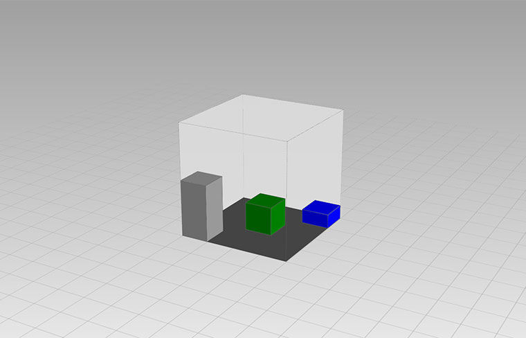

Room3D
======

介绍
---

> Room3D是一款JS插件，它可以帮你用纯html/css快速构建3D房间或盒子。  
> 这是一个轻量级的应用，设计它的初衷仅用于帮助快速构建一些简单布局的场景。或者用于一些少量盒子的3D特效。不过如果你需要构建非常复杂的场景，建议使用类似three.js这样的3D引擎。  
  

<br/>

   

使用方法
---
### I 标签引入

1. 通过 `<script src="room3d.js"></script>` 标签引入，你将获得一个名为 `Scene3D` 的构造函数
   
2. 准备Html元素 `<div id="wraper"><div>` 该对象需要手动为其设置css `width` 和 `height`
   
3. 编写脚本使用配置项创建场景和元素吧  
   ```
   let myScene = new Scene3D("#wraper",{
      width:"400px",
      depth:"400px",
      rooms:[
        {
          height:"400px",
          boxes:[
            {
              width:"100px",
              depth:"100px",
              height:"100px",
              left:"150px",
              top:"160px",
              color:"green"
            }
          ]
        }
      ]
    })
    ```