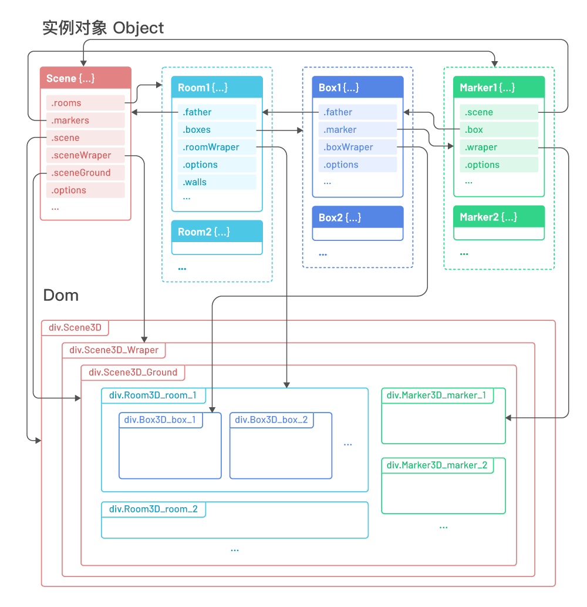

# Room3D

## 介绍


Room3D是一款JS插件，它能帮你用纯html/css快速构建3D房间和盒子。  
这是一个轻量级的应用，设计它的初衷仅用于帮助开发者快速构建简单布局的3D场景，或者用于简易3D特效。如果你需要构建复杂场景，且对渲染效果要求较高，建议使用基于WebGL框架的3D库，如three.js等。  
  
————  作者：DAN 

***
中文文档 &nbsp;&nbsp; | &nbsp;&nbsp; [English Document](readme-en.md) &nbsp;&nbsp;|&nbsp;&nbsp; [DEMO on gitee](http://dan90s.gitee.io/room3d) &nbsp;&nbsp;|&nbsp;&nbsp; [DEMO on git](https://danhu1990.github.io/Room3D/) 

---
 

  

## 使用方法


1. 安装插件，你将获得一个名为 `Scene3D` 的构造函数
   + 通过 `<script src="room3d.js"></script>` 标签引入html文件，或者  
   + 在模块化开发中，通过 `npm install room3d` 安装插件，然后
     - 使用 `const Scene3D = require("room3d")` 或者
     - `import Scene3D from "room3d"` 都能获得 `Scene3D` 构造函数
  
2. 引入样式文件 `room3d.css`
   
3. 准备Html元素 `<div id="wraper"><div>` ，选择器可使用id或class。你可以手动为元素设置css `width` 和 `height` ，如果未设置，插件将会为其设置 `widt:100%; height:100%;` 
   
4. 编写脚本使用配置项创建场景和元素吧  
   
    ```javascript
    let myScene = new Scene3D("#wraper",{
      width:"400px",
      depth:"400px",
      rooms:[
        {
          height:"400px",
          boxes:[
            {
              width:"100px",
              depth:"100px",
              height:"100px",
              left:"150px",
              top:"160px",
              color:"green"
            }
          ]
        }
      ]
    })
    ```
## 关系图

 

## API

### Scene 场景对象

#### 配置项  

| 属性 | 值类型 | 默认值 | 说明 |
| :---- | :----: | :----: | ---- |
| **width** | string | "1000px" | 场景宽度，必须包含px等单位，不允许百分比、负值 |
| **depth** | string | "1000px" | 场景进深，必须包含px等单位，不允许百分比、负值 |
| **offsetVer** | string | "-200px" | 场景垂直方向偏移，负数为向下偏移，正数向上偏移，不允许百分比 |
| **rotateVer** | string | "70deg" | 场景初始垂直方向旋转角度，必须携带单位deg，负值为反方向旋转 |
| **rotateHor** | string | "-40deg" | 场景初始水平方向旋转角度，必须携带单位deg，负值为反方向旋转 |
| **scaleRat** | number | 0.8 | 场景初始缩放比例，不允许百分比、负值 |
| **wheelScale** | boolean | true | 允许使用滚轮缩放场景 |
| **showGrid** | boolean | true | 是否显示网格 |
| **perspective** | number | 2000 | 透视系数，不允许负值，默认2000，值越小透视感越强，值越大透视感越弱。建议最小值不低于800，最大值不超过8000。 |
| **dragRotate** | boolean | true | 允许使用鼠标拖拽旋转场景 |
| **rotateFixed** | string | "aroundRestric" | 旋转限制，仅在 `dragRotate` 设置为 `true` 有效，可选值：<br/> "`around`" ：可水平、垂直任意旋转。 <br/> "`aroundRestric`" ：带有限制的任意旋转，其中垂直旋转只允许0-90度，最终效果表现为，不能将场景旋转至倒立。<br/> "`horizontal`" ：只允许水平任意旋转。<br/> "`vertical`" ：只允许垂直任意旋转<br/> "`verticalRestric`" ：带有限制的垂直旋转。|
| **rooms** | array | [ ] | 房间对象，用于配置Room房间对象 |

#### 方法  
  
创建一个Scene对象 `let Scene = new Scene3D("#Scene1")` ，该对象将可以使用以下方法：

+ **`Scene.showGrid( boolean )`**
  - **参数**\
    boolean {boolean} | `必须` | 传true表示显示，false表示隐藏

  - **返回值**\
    返回当前Scene对象，可用于链式调用

  - **说明**\
    用于显示或隐藏场景的网格
      
+ **`Scene.resetScene()`**
  - **参数**\
    \-

  - **返回值**\
    返回当前Scene对象，可用于链式调用
    
  - **说明**\
    重置场景旋转和缩放状态至初始值

+ **`Scene.buildRoom( options )`**
  - **参数**\
    options {object} | `可选` | 配置对象，参照Scene配置项

  - **返回值**\
    返回被创建的Room对象
    
  - **说明**\
    用传入的配置参数，手动创建Room，如果不传options参数，则使用默认配置创建Room


***

### Room 房间对象

#### 配置项  

| 属性 | 值类型 | 默认值 | 说明 |
| :---- | :----: | :----: | ---- |
| **className** | string | "" | 房间名，将使用 `"Room3D_room_"` 进行拼接，用作房间容器的class类名 |
| **width** | string | "100%" | 房间宽度，必须包含px等单位，允许使用百分比，不允许负值 |
| **depth** | string | "100%" | 房间进深，必须包含px等单位，允许使用百分比，不允许负值 |
| **height** | string | "300px" | 房间高度，必须包含px等单位，不允许百分比、负值 |
| **left** | string | "auto" | 房间距场景左边缘距离，可设置为包含单位的数值、百分比或 `auto` |
| **top** | string | "auto" | 房间距场景后边缘距离，可设置为包含单位的数值、百分比或 `auto` |
| **right** | string | "auto" | 房间距场景右边缘距离，可设置为包含单位的数值、百分比或 `auto` |
| **bottom** | string | "auto" | 房间距场景前边缘距离，可设置为包含单位的数值、百分比或 `auto` |
| **showWall** | boolean | true | 是否显示墙壁 |
| **wallColor** | string | "#ddd" | 墙壁颜色，可使用css支持的所有色值类型 |
| **wallOpacity** | number | 0.9 | 墙壁透明度 |
| **wallBackFace** | string | "hidden" | 墙背面是否透明，可选参数: "hidden" , "visible" |
| **showLine** | boolean | true | 是否显示墙角线 |
| **lineColor** | string | "#666" | 墙角线颜色，可使用css支持的所有色值类型 |
| **lineOpacity** | number | 1 | 墙角线透明度 |
| **lineWidth** | string | "1px" | 墙角线粗细 |
| **showFloor** | boolean | true | 是否显示地板 |
| **floorColor** | string | "#444" | 地板颜色，可使用css支持的所有色值类型 |
| **floorOpacity** | number | 1 | 地板透明度 |
| **boxes** | array | [ ] | 房间内Box盒子对象 |

其中 `top` `right` `bottom` `left` 用于定位房间在场景中的位置，一般 `left` 和 `right` 只需要设置其中一项即可。`top` 和 `bottom` 同理\
关于宽度、进深、高度如何定义，可查看文档顶部的图示。

#### 方法

创建一个Room对象 `let Room = Scene.buildRoom()` 。如果是通过配置对象生成的Room，则可以通过 `let Room = Scene.rooms[index]` 获得Room对象，该对象可以使用以下方法：

+ **`Room.showFloor( boolean )`**
+ **`Room.showWall( boolean )`**
+ **`Room.showLine( boolean )`** 
  - **参数**\
    boolean {boolean} | `必须` | 传true表示显示，false表示隐藏
  
  - **返回值**\
    返回当前Room对象，可用于链式调用

  - **说明**\
    用于显示或隐藏Room的Floor地板、Wall墙壁、Line墙角线。

+ **`Room.backface( value )`** 
  - **参数**\
    value {string} | `必须` | value可以为 "hidden" 或 "visible" 
  
  - **返回值**\
    返回当前Room对象，可用于链式调用

  - **说明**\
    用于设置墙壁元素的 `backface-visibility` 样式，具体表现是：设置为"hidden"，朝向屏幕方向的墙壁将变成透明的，从而可以看见房间内的元素，且不会遮挡鼠标与房间内元素的交互。

+ **`Room.buildDoor( wall , doorOptions )`**
  - **参数**\
    wall {string} | `必须` | wall参数可选值为 "left" , "right" , "fore" , "back"<br/>
    doorOptions {object} | `可选` | 门的配置项对象，详细配置参数见下方的Door配置项。

  - **返回值**\
    返回被创建的Door对象
    
  - **说明**\
    用传入的配置参数，手动创建Door。
    ##### Door 配置项
    | 属性 | 值类型 | 默认值 | 说明 |
    | :---- | :----: | :----: | ---- |
    | **className** | string | "" | 门类名，将使用 `"Room3D_door_"` 进行拼接，用作门容器的class类名 |
    | **width** | string | "60px" | 门宽度，必须包含px等单位，允许使用百分比，不允许负值 |
    | **height** | string | "120px" | 门高度，必须包含px等单位，允许使用百分比，不允许负值 |
    | **left** | string | "50%" | 门距墙左边缘距离，可设置为包含单位的数值或百分比值 |
    | **right** | string | \- | 门距墙右边缘距离，可设置为包含单位的数值或百分比值，如果希望以 `right` 值作为定位，必须将 `left` 设置为 `auto` |
    | **show** | boolean | true | 是否显示门，如果为 `false` ，则只能看到门洞。 |
    | **type** | string | "single left" | 门类型，可选参数：`"single left"` 单开门，门轴在左侧、 `"single right"` 单开门，门轴在右侧、 `"double"` 双开门。 |
    | **openSide** | string | "outside" | 开门的方向，`"outside"` 朝外开门、 `"inside"` 朝内开门。 |
    | **color** | string | "#634A42" | 颜色色值，设置门板的颜色。 |
    | **doorFrameWidth** | string | "3px" | 门框宽度，可以为包含单位的数值，不允许百分比。 |
    | **doorFrameColor** | string | "#3B2A24" | 门框颜色 |
    ##### Door 方法 
    使用 `let Door = Room.buildDoor( wall , doorArray )[index]` 或者 `let Door = Room.walls[wall].doors[index]` 获取Door对象，其中 `wall` 为 `"left"` , `"right"` , `"fore"` , `"back"` 四个值中的一个。
    + **`Door.openDoor()`** 将门打开
    + **`Door.closeDoor()`** 将门关闭

+ **`Room.buildBox( options )`**
  - **参数**\
    options {object} | `可选` | 配置对象，参数见Box配置项

  - **返回值**\
    返回被创建的Box对象
    
  - **说明**\
    用传入的配置参数，手动创建Box，如果不传options参数，则使用默认配置创建Box

***

### Box 盒子对象

#### 配置项  

| 属性 | 值类型 | 默认值 | 说明 |
| :---- | :----: | :----: | ---- |
| **className** | string | "" | 盒子名，将使用 `"Box3D_box_"` 进行拼接，用作盒子容器的class类名 |
| **name** | string | "" | 盒子名称，将显示在Marker标注上 |
| **width** | string | "100%" | 盒子宽度，必须包含px等单位，允许使用百分比，不允许负值 |
| **depth** | string | "100%" | 盒子进深，必须包含px等单位，允许使用百分比，不允许负值 |
| **height** | string | "100%" | 盒子高度，必须包含px等单位，允许使用百分比，不允许负值 |
| **left** | string | "auto" | 盒子距房间左边缘距离，可设置为包含单位的数值、百分比或 `auto` |
| **top** | string | "auto" | 盒子距房间后边缘距离，可设置为包含单位的数值、百分比或 `auto` |
| **right** | string | "auto" | 盒子距房间右边缘距离，可设置为包含单位的数值、百分比或 `auto` |
| **bottom** | string | "auto" | 盒子距房间前边缘距离，可设置为包含单位的数值、百分比或 `auto` |
| **offsetZ** | string | "0px" | 垂直偏移距离，必须包含单位，不允许百分比，负值表示向下偏移 |
| **rotateX** | string | "0deg" | X轴旋转角度，必须包含单位deg |
| **rotateY** | string | "0deg" | Y轴旋转角度，必须包含单位deg |
| **rotateZ** | string | "0deg" | Z轴旋转角度，必须包含单位deg |
| **opacity** | number | 1 | 盒子透明度 |
| **color** | string | "#999" | 盒子颜色，可使用css支持的所有色值类型 |
| **showLine** | boolean | true | 是否显示边角线 |
| **lineColor** | string | "#666" | 边角线颜色，可使用css支持的所有色值类型 |
| **lineOpacity** | number | 1 | 边角线透明度 |
| **lineWidth** | string | "1px" | 边角线粗细 |
| **marker** | object | { } | 盒子标注配置项 |

  其中 `top` `right` `bottom` `left` 用于定位盒子在房间中的位置，一般 `left` 和 `right` 只需要设置其中一项即可。`top` 和 `bottom` 同理

#### 方法 

创建一个Box对象 `let Box = Room.buildBox()` 。如果是通过配置对象生成的Box，则可以通过 `let Box = Room.boxes[index]` 获得Box对象，该对象可以使用以下方法：

+ **`Box.showLine( boolean )`** 
+ **`Box.showMarker( boolean )`** 
  - **参数**\
    boolean {boolean} | `必须` | 传true表示显示，false表示隐藏
  
  - **返回值**\
    返回当前Box对象，可用于链式调用

  - **说明**\
    用于显示或隐藏Box的Line边角线、Marker标注。

+ **`Box.buildMarker( options )`**
  - **参数**\
    options {object} | `可选` | 配置对象，参数见Marker配置项

  - **返回值**\
    返回被创建的Marker对象
    
  - **说明**\
    Marker对象会在Box对象创建的时候自动使用默认配置创建，该方法实际上是先销毁原有的标注，再用新的配置项重新创建一个标注。如果你只是希望改变标注的一些数据，可以使用Marker对象的 `updateMarker()` 方法。

***

### Marker 标注对象

#### 配置项  

| 属性 | 值类型 | 默认值 | 说明 |
| :---- | :----: | :----: | ---- |
| **width** | string | "auto" | 标注宽度，必须包含px等单位，不允许百分比和负值，默认自适应 |
| **height** | string | "auto" | 标注高度，必须包含px等单位，不允许百分比和负值，默认自适应 |
| **left** | string | expression | 标注距场景左边缘距离，可设置为包含单位的数值、百分比或 `auto` |
| **top** | string | expression | 标注距场景后边缘距离，可设置为包含单位的数值、百分比或 `auto` |
| **right** | string | "auto" | 标注距场景右边缘距离，可设置为包含单位的数值、百分比或 `auto` |
| **bottom** | string | "auto" | 标注距场景前边缘距离，可设置为包含单位的数值、百分比或 `auto` |
| **offsetZ** | string | expression | 标注在场景中的垂直高度，可设置为包含单位的数值，不允许百分比、 `auto`或负值。 |
| **show** | boolean | true | 是否显示标注 |
| **lineColor** | string | "#666" | 标注连接线颜色 |
| **lineWidth** | string | "1px" | 标注连接线宽度 |
| **fontSize** | string | "14px" | 标注默认文字大小 |
| **fontColor** | string | "#ffffff" | 标注文字颜色 |
| **backgroundColor** | string | "rgba(36, 212, 174, 0.9)" | 标注背景色,Marker对象没有提供opacity属性，如果需要让标注透明，可以使用带有alpha通道的色值。 |
| **content** | string | "\<h4\>\{\{params.title\}\}\<\/h4>" | 标注内容模板，可使用{{params.属性名}}的形式作为占位符，用于接收params属性传入的参数。你可以使用html字符串编辑更丰富的标注模板 |
| **params** | object |\{title:box.options.name \|\| "Marker"\}| 传递的参数，用于解析标注内容模板，默认会将与之绑定的Box对象配置项中的name值传递进来。 |

由于在dom结构中标注是直接创建在场景中，所以其 `top` `right` `bottom` `left` 是相对于场景的定位，同样一般 `left` 和 `right` 以及`top` 和 `bottom`只需要设置其中一项即可。并且由于 `left` 和 `top` 的默认值是一个表达式，用于将标注创建在盒子的正上方，所以如果需要用 `right` 和 `bottom` 进行定位，则必须将对应的 `left` 和 `top` 值设置为 `auto` 。 

#### 方法 

创建一个Marker对象 `let Marker = Box.buildMarker()` 。如果是通过配置对象生成的Marker，则可以通过 `let Marker = Box.marker` 获得Marker对象，该对象可以使用以下方法：

+ **`Marker.updateMarker( params )`** 
  - **参数**\
    params {object} | `必须` | params对象必须包含与标注content模板相匹配的属性，以及需要更新的值。
  
  - **返回值**\
    返回当前Marker对象

  - **说明**\
    用于更新Marker内容模板。

+ **`Marker.destroy()`**
  - **参数**\
    \-

  - **返回值**\
    \-
    
  - **说明**\
    销毁Marker实例对象

***

## 注意事项


1. 所有的长度数值必须使用统一的单位，推荐使用px，否则会出现一些因为单位换算而导致的bug
   
2. 两个紧贴相邻的Room如果需要在紧贴着的墙上创建门，需要在两个Room上对应的墙上都使用 `buildDoor()` 方法，在对称的位置创建门，同时将其中一个门设置为不可见，即可实现。
   
3. 你还可以使用css为场景内的各种元素设置 `background-image` 样式，模仿贴图效果，从而实现更丰富的场景。
   
   
## 版本与更新

+ `1.0.0` 发布时间：2022/6/8


## 其他


